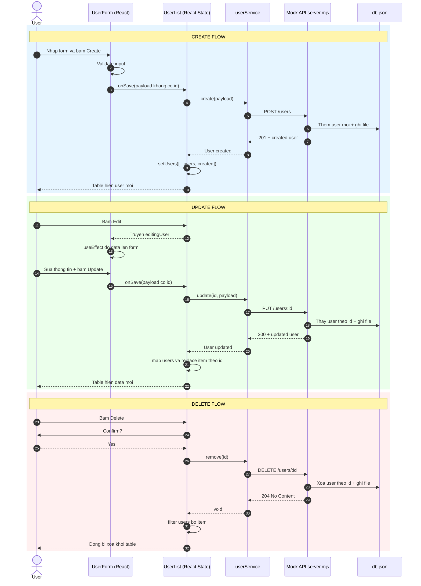

# CRUD Technical Summary (React + TypeScript + Mock API)

## 1. Muc tieu
Tai lieu nay tong hop toan bo technical flow cua chuc nang CRUD user trong project React hien tai, bao gom:
- Kien truc frontend/backend mock
- Vai tro tung source file
- Sequence flow cho Create/Update/Delete
- API contract va error handling
- Cach chay local va checklist verify

## 2. Kien truc tong the
He thong duoc tach thanh 3 lop:

1. UI Layer (React Components)
- Hien thi form, bang du lieu, loading, error
- Nhan thao tac nguoi dung (Create/Edit/Delete/Reload)

2. Service Layer (HTTP Abstraction)
- Gom cac ham goi API: getAll, create, update, remove
- Chuan hoa xu ly response/error

3. Mock Backend Layer (Node server + db.json)
- Cung cap REST API /users
- Doc/ghi du lieu persistent vao db.json

## 3. Source map va vai tro

### Frontend entry
- `src/main.tsx`
  - Mount React app vao #root
  - Import global styles

- `src/App.tsx`
  - Layout tong + tieu de
  - Render component `UserList`

### Domain model
- `src/models/user.ts`
  - Dinh nghia type `User`
  - Dam bao contract thong nhat giua form, list, service

### Service layer
- `src/services/userService.ts`
  - API_URL: http://localhost:3000/users
  - Ham `handleResponse<T>`:
    - Throw error neu `res.ok = false`
    - Return `undefined` cho 204
    - Parse JSON cho cac status con lai
  - CRUD methods:
    - `getAll()` -> GET /users
    - `create(payload)` -> POST /users
    - `update(id, payload)` -> PUT /users/:id
    - `remove(id)` -> DELETE /users/:id

### UI components
- `src/components/UserForm.tsx`
  - Quan ly controlled form state: name, email, role
  - Validate:
    - required cho name/email/role
    - regex email format
  - `touched` state de hien thi loi dung thoi diem
  - Che do Create/Edit dua tren `editingUser`
  - Submit callback len cha qua `onSave(payload)`

- `src/components/UserList.tsx`
  - State chinh:
    - `users`: danh sach user tren UI
    - `editingUser`: user dang sua
    - `loading`: trang thai dang call API
    - `errorMsg`: thong bao loi
  - Ham chinh:
    - `reload()`: load danh sach
    - `onSave(payload)`: branch create/update
    - `remove(user)`: confirm + delete
  - UI behavior:
    - Disable action khi loading
    - Render table + total

### Styling
- `src/styles.css`
  - Layout responsive 2 cot
  - Card/table/form controls
  - Visual state cho button/error

### Mock backend
- `mock-api/server.mjs`
  - Server Node HTTP thuong (khong can json-server)
  - CORS headers cho frontend khac port
  - Data source: `db.json`
  - Route handlers:
    - GET /users
    - POST /users
    - PUT /users/:id
    - DELETE /users/:id
  - ID generation cho create: `max(id) + 1`

### Data store
- `db.json`
  - Luu mang `users`
  - Du lieu se thay doi sau moi thao tac CRUD

## 4. Sequence flow chi tiet

## 5. API contract

### GET /users
- Response 200: `User[]`

### POST /users
- Body: `{ name, email, role }`
- Response 201: `{ id, name, email, role }`

### PUT /users/:id
- Body: `{ name, email, role }`
- Response 200: `{ id, name, email, role }`

### DELETE /users/:id
- Response 204: no content

### Loi co the gap
- 400: invalid id
- 404: user not found
- 405: method not allowed
- 500: internal server error

## 6. State management va dong bo UI
- Dang dung local state trong `UserList` lam source of truth cho list tren UI.
- Sau khi API thanh cong moi cap nhat UI (pessimistic update).
- `loading` giup khoa thao tac trung lap.
- `errorMsg` hien thi loi theo action.

## 7. Validation strategy
- Validate o layer form truoc khi goi API.
- Rule:
  - Name: required
  - Email: required + regex format
  - Role: required
- `touched` giup UX: chi hien loi khi nguoi dung da thao tac.

## 8. Scripts va run local
Trong `package.json`:
- `npm run mock-api` -> chay API local (port 3000)
- `npm run dev` -> chay React app (Vite)
- `npm run build` -> type-check + build

Run de test:
1. Terminal A: `npm run mock-api`
2. Terminal B: `npm run dev -- --host`
3. Mo URL Vite in ra (thuong 3001 neu 3000 dang dung cho API)

## 9. Quick technical checklist
- [ ] GET /users tra du lieu
- [ ] Create tao dong moi va persist vao db.json
- [ ] Update sua dung dong theo id
- [ ] Delete xoa dung dong theo id
- [ ] Reload dong bo lai du lieu tu backend
- [ ] Loading/disable buttons hoat dong dung
- [ ] Error message hien thi dung khi API fail

## 10. Huong nang cap tiep
- Tach loading theo tung action (read/create/update/delete)
- Toast notification thay cho text error co ban
- Search + pagination
- Replace confirm() bang modal component
- Them test (unit cho service/form, integration cho CRUD flow)
